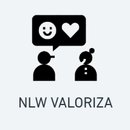

<h1 align="center">
  
</h1>

  <a href="#technologist-tecnologias">Tecnologias</a>&nbsp;&nbsp;&nbsp;|&nbsp;&nbsp;&nbsp;
  <a href="#-projeto">Projeto</a>&nbsp;&nbsp;&nbsp;|&nbsp;&nbsp;&nbsp;
  <a href="#scroll-regras">Regras</a>&nbsp;&nbsp;&nbsp;|&nbsp;&nbsp;&nbsp;
  <a href="#-como-executar">Como executar</a>&nbsp;&nbsp;&nbsp;|&nbsp;&nbsp;&nbsp;
  <a href="#-licença">Licença</a>

## :technologist: Tecnologias

Este projeto faz uso das seguintes tecnologias:
- [NodeJS](https://nodejs.org/)
- [SQLite](https://www.sqlite.org/)
- [TypeScript](https://www.typescriptlang.org/)
- [TypeORM](https://typeorm.io/)
- [JWT](https://jwt.io/)

## 💻 Projeto

O NLW Valoriza é uma aplicação backend que permite o usuário criar mensagens de elogios com tags para outros usuários.
Essa aplicação é resultado das aulas do Next Level Week Together na plataforma da Rocketseat.

## :scroll: Regras

- Cadastro de usuário

  [ ] Não é permitido cadastrar mais de um usuário com o mesmo e-mail

  [ ] Não é permitido cadastrar o usuário sem e-mail

- Cadastro de TAG

  [ ] Não é permitido cadastrar mais de uma tag com o mesmo nome

  [ ] Não é permitido cadastrar tag sem nome

  [ ] Não é permitido o cadastro por usuários que não sejam administradores

- Cadastro de elogios

  [ ] Não é permitido um usuário cadastrar um elogio para si

  [ ] Não é permitido cadastrar elogios para usuários inválidos

  [ ] O usuário precisa estar autenticado na aplicação

## 🚀 Como executar

- Clone o repositório
- Instale as dependências com `yarn install`
- Inicie o servidor com `yarn dev`

O servidor deverá iniciar no endereço: [http://localhost:3000](http://localhost:3000)

## 📄 Licença

Acesse [LICENSE](LICENSE.md) para mais informações sobre a licença.

## ♥ Agradecimento

A toda a equipe da Rocketseat por mostrar os caminhos para o próximo nível!